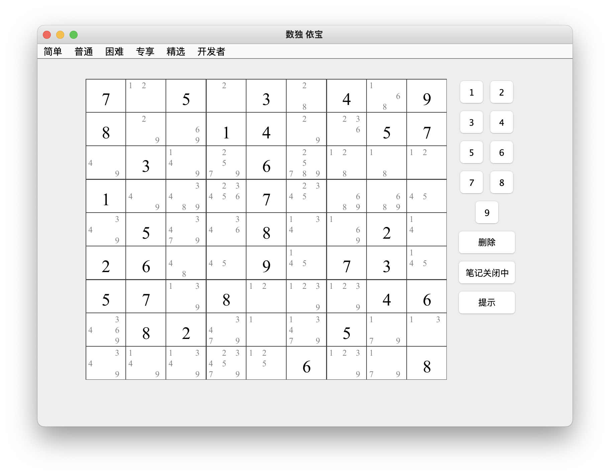

# 数独 【依宝】
项目是基于java Swing 实现的一个数独游戏。项目的主要特点：精良的关卡、操作功能丰富、实现了主流的数独
求解策略、解题器、数独关卡设计器、支持多语言。
项目部分代码基于  [sudoku](https://github.com/mattnenterprise/Sudoku)

## 
1，提供精心设计的数独游戏，提供简单、普通、困难、精选四种难度模式，

2，功能丰富：后续数、强大的提示器；；；

3，实现了10+的数独策略，包括。。。

4，数独解题器，包括两种模式，按策略求解 和 暴力破解

5，数独游戏设计器

6，多语言：中文、英语

## 如何运行 

## 策略介绍

## 数独解题器

## 数独游戏设计器

## 待完成 
7，数独技术训练器

part is forked from https://github.com/mattnenterprise/Sudoku