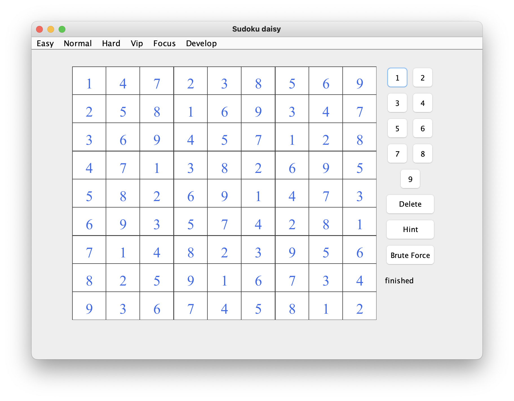

# Sudoku Daisy           -------------------------      [中文](https://github.com/sesamegu/sudoku/blob/main/README_CN.md)              
This is a Sudoku game programmed using Java and Swing for the GUI. It's based on [sudoku](https://github.com/mattnenterprise/Sudoku)     
Features:
* Well design 35+ puzzles.
* Support the popular techniques 
* Good user experience 
* the Solver
* Game generator
* Multiple Languages     

   
   

## How to run
* for the developer     
   main class: com.sesame.game.Sudoku

## Strategy
[last free cell](https://github.com/sesamegu/sudoku/blob/main/docs/last_free_cell_EN.md)       
[last possible number](https://github.com/sesamegu/sudoku/blob/main/docs/last_possible_number_EN.md)          
[hidden singles](https://github.com/sesamegu/sudoku/blob/main/docs/hidden_singles_EN.md)      
[obvious pairs](https://github.com/sesamegu/sudoku/blob/main/docs/obvious_pairs_EN.md)      
[obvious triples](https://github.com/sesamegu/sudoku/blob/main/docs/obvious_triples_EN.md)      
[hidden pairs](https://github.com/sesamegu/sudoku/blob/main/docs/hidden_pairs_EN.md)      
[hidden triples](https://github.com/sesamegu/sudoku/blob/main/docs/hidden_triples_EN.md)      
[pointing pairs](https://github.com/sesamegu/sudoku/blob/main/docs/pointing_pairs_EN.md)      
[row column to box](https://github.com/sesamegu/sudoku/blob/main/docs/row_column_to_box_EN.md)       
[x wing](https://github.com/sesamegu/sudoku/blob/main/docs/x_wing_EN.md)      
[xy wing](https://github.com/sesamegu/sudoku/blob/main/docs/xy_wing_EN.md)      
[swordfish](https://github.com/sesamegu/sudoku/blob/main/docs/swordfish_EN.md)      

## Solver
You can input any sudoku puzzle and get the answer.      
there are two methods for computing : the hint mode and the brute force mode.        
the hint mode's advantage : you can see every step's strategy       
the brute force mode's advantage: you can crack any Sudoku puzzle.       

   

## Game Designer
all the puzzles in the game is generated by the "game designer", please check the code (no GUI yet)
      com.sesame.game.tool.GameGenerator
