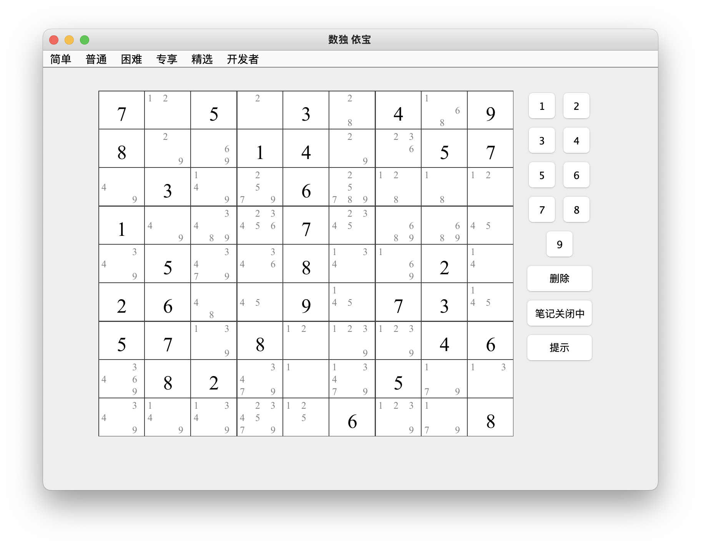
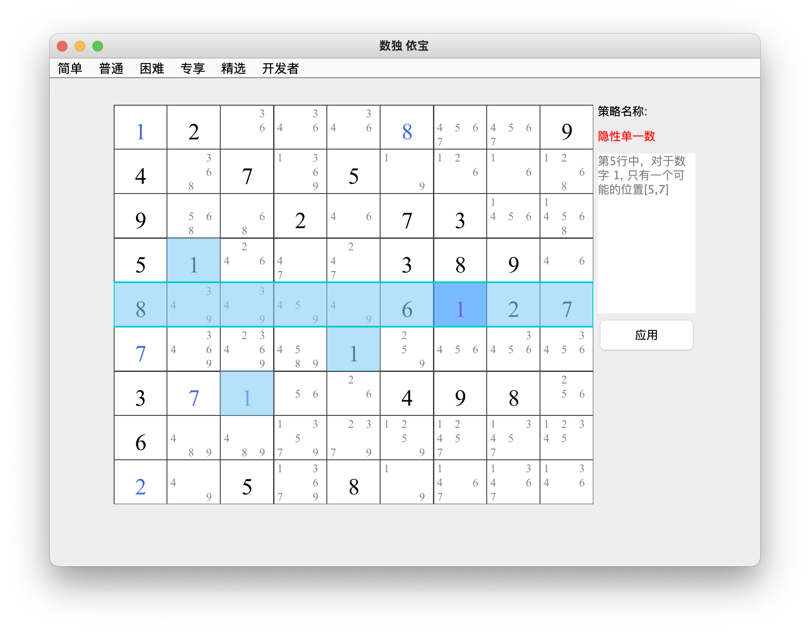
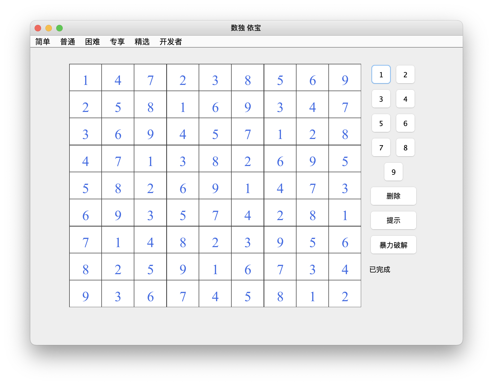

# 数独 【依宝】          -------------------------      [English](https://github.com/sesamegu/sudoku) 
项目是基于java Swing 实现的一个数独游戏。项目的主要特点：精良关卡、操作功能丰富、实现了主流的求解技巧、解题器、关卡设计器、支持多语言。
项目部分代码基于  [sudoku](https://github.com/mattnenterprise/Sudoku)     

   

## 特点
* 精良关卡   
   提供简单、普通、困难、专项四种难度模式，在简单模式中涉及2种技巧即可过关，普通模式3、4种，困难模式5、6种，而在专项模式中涉及
   到8种以上的技巧才能过关。
* 操作功能丰富     
   提示功能：所有关卡中，每一步都能提供对应各种技巧的展示和答案
   候选数笔记：在空白格中标记数字
   删除：删除单元格数字
* 实现了主流的求解技巧    
    唯余空白格、唯一候选数、隐性单一数、显性数对、显性三数对、隐形数对、隐形三数对、宫区块数对、行列摒除区块、x翼、xy翼、剑鱼等
* 解题器      
  在解题器模式中，你可以输入自己的数独谜题，程序会自动求解。求解支持两种方式：技巧求解和暴力求解。技巧求解就是本程序支持的技巧求解，整体
  解题过程和思路清晰可见；暴力求解则是程序直接遍历所有可能找出解
* 关卡设计器      
  采用随机程序，自动输出各种关卡。本游戏的关卡为这个功能自动产生。
* 多语言      
   支持中文、英语

## 如何运行 
* Windows
    下载[sudoku.zip](https://github.com/sesamegu/sudoku/releases/download/1.0.0/sudoku.zip) 文件，点击运行"windows_run.bat"文件       
* Mac or Linux
    下载[sudoku.zip](https://github.com/sesamegu/sudoku/releases/download/1.0.0/sudoku.zip) 文件，在命令行运行"mac_linux_run.sh"文件 
* 准对开发者     
   程序的入口类 com.sesame.game.Sudoku
      
## 策略介绍
[唯余空白格](https://github.com/sesamegu/sudoku/blob/main/docs/last_free_cell_CN.md)      
[唯一候选数](https://github.com/sesamegu/sudoku/blob/main/docs/last_possible_number_CN.md)      
[隐性单一数](https://github.com/sesamegu/sudoku/blob/main/docs/hidden_singles_CN.md)      
[显性数对](https://github.com/sesamegu/sudoku/blob/main/docs/obvious_pairs_CN.md)      
[显性三数](https://github.com/sesamegu/sudoku/blob/main/docs/obvious_triples_CN.md)      
[隐形数对](https://github.com/sesamegu/sudoku/blob/main/docs/hidden_pairs_CN.md)      
[隐形三数](https://github.com/sesamegu/sudoku/blob/main/docs/hidden_triples_CN.md)      
[宫区块数对](https://github.com/sesamegu/sudoku/blob/main/docs/pointing_pairs_CN.md)    
[行列摒除区块](https://github.com/sesamegu/sudoku/blob/main/docs/row_column_to_box_CN.md)      
[x翼](https://github.com/sesamegu/sudoku/blob/main/docs/x_wing_CN.md)      
[xy翼](https://github.com/sesamegu/sudoku/blob/main/docs/xy_wing_CN.md)      
[剑鱼](https://github.com/sesamegu/sudoku/blob/main/docs/swordfish_CN.md)      

## 数独解题器
这块你可以输入你碰到的任意数独谜题，然后得到答案。     
可以分两种模式进行计算：按步提示（点击提示按钮）和 暴力破解（点击暴力破解按钮）。      
按步提示：基于已经实现的技巧进行破解，优点是每步解法清晰可见，缺点是部分谜题可能无法解答；       
暴力破解：穷举所有可能性进行破解，优点是能破解任意谜题，缺点是知其然不知其所以然。        

   

## 数独游戏设计器
本游戏中的关卡都是由"数独游戏设计器"自动生成，可参见代码（当前没有界面）      
      com.sesame.game.tool.GameGenerator
