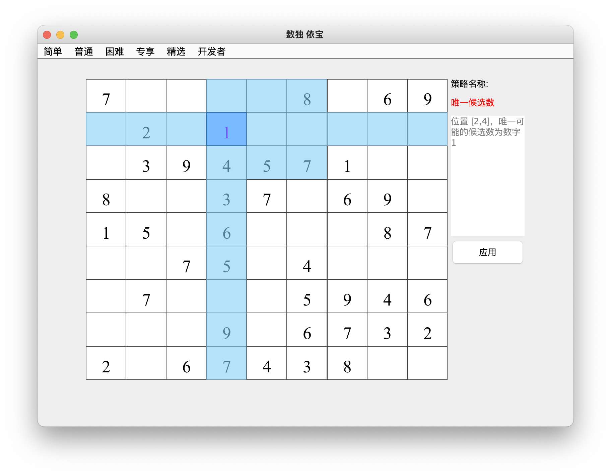
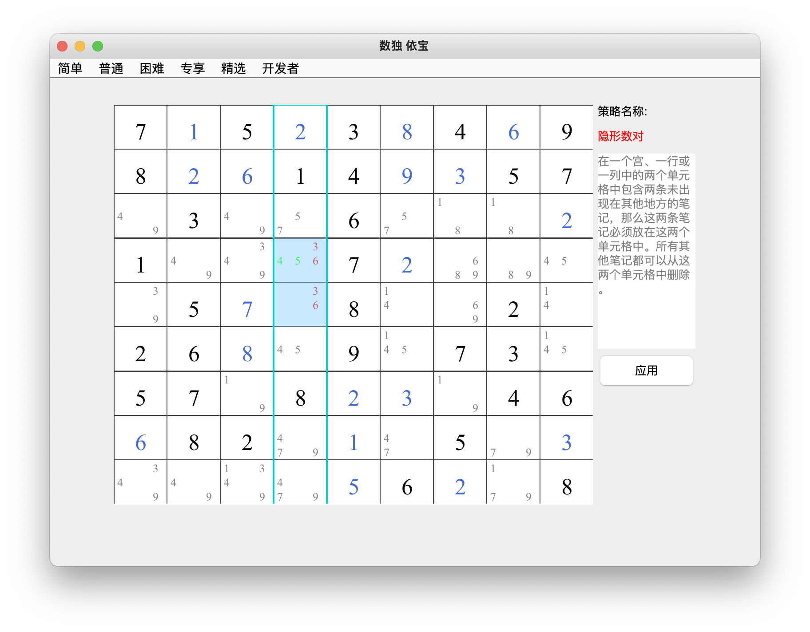

# 数独 【依宝】                        [English](https://github.com/sesamegu/sudoku) 
项目是基于java Swing 实现的一个数独游戏。项目的主要特点：精良关卡、操作功能丰富、实现了主流的求解技巧、解题器、关卡设计器、支持多语言。
项目部分代码基于  [sudoku](https://github.com/mattnenterprise/Sudoku)

## 特点
* 精良关卡   
   提供简单、普通、困难、专项四种难度模式，在简单模式中涉及2种技巧即可过关，普通模式3、4种，困难模式5、6种，而在专项模式中涉及
   到8种以上的技巧才能过关。
* 操作功能丰富     
   提示功能：所有关卡中，每一步都能提供对应各种技巧的展示和答案
   候选数笔记：在空白格中标记数字
   删除：删除单元格数字
* 实现了主流的求解技巧    
    唯余空白格、唯一候选数、隐性单一数、显性数对、显性三数对、隐形数对、隐形三数对、宫区块数对、x翼、xy翼、剑鱼、三三三 等
* 解题器      
  在解题器模式中，你可以输入自己的数独谜题，程序会自动求解。求解支持两种方式：技巧求解和暴力求解。技巧求解就是本程序支持的技巧求解，整体
  解题过程和思路清晰可见；暴力求解则是程序直接遍历所有可能找出解
* 关卡设计器      
  采用随机程序，自动输出各种关卡。本游戏的关卡为这个功能自动产生。
* 多语言      
   支持中文、英语

## 如何运行 
* 准对开发者     
   程序的入口类 com.sesame.game.Sudoku
* Mac or Linux    
   to do
* Windows    
   to do
## 策略介绍
[唯余空白格](https://github.com/sesamegu/sudoku/blob/main/docs/last_free_cell_CN.md)
* 唯一候选数  
介绍：一个宫、一行或一列中只剩下一个空白单元格，找出缺少哪个数字，将它填入这个空白单元格

* 隐性单一数    
介绍：在一个宫、一行或一列中对于特定的某个数字只有一个可行的位置     

* 显性数对    
介绍：一个宫、一行或一列里找到两个拥有相同的两个候选数的格，则可从该单元里的其他格中排除那两个候选数     

* 显性三数对    
介绍：一个宫、一行或一列里找到三个具有三对数的三个候选数的格，则可从该单元里的其他格中排除那三个候选数  

* 隐形数对    
介绍：在一个宫、一行或一列中的两个单元格中包含两条未出现在其他地方的笔记，那么这两条笔记必须放在这两个单元格中。所有其他笔记都可以从这两个单元格中删除。  

* 隐形三数对    
介绍：在一个宫、一行或一列中的三个单元格包含三条未出现在其他地方的笔记，这三个单元格还包含其他候选数，可以将它们删除。     

* 宫区块数对    
介绍：当一条笔记在一个宫中出现两次或者三次并且该笔记属于同一行或列时，这说明该笔记必然是这个宫中解，可以将该笔记从这一行或列的任何其他单元格中删除。     

* x翼    
介绍：寻找四个对齐的单元格形成一个X，并且有相同的候选数没有出现在同一行或同一列的其他地方，那么可以删除对应列或行的后续数     

* xy翼    
介绍：由三个双值单元格构成，两个单元格作为“钳”，一个作为“折”，“钳”和“折”位于同一行、同一列或同一宫中。每个“钳”中的两个数字之一应该与“折点”中的相同。两个“钳”中的另一个数字相同"。可以删除另一个“折”的的后续数。    

* 剑鱼    
介绍：三行或三列里找到两个拥有本区域内唯二候选数的格，这三行或三列的格两两对齐，那么对应列或行的这个候选数     

* 三三三    
介绍：在一行、一列、一宫中有三个单元格候选的的数字都为3个且完全相同，那么可以排除其它单元格包含这个三个数字    

## 数独解题器

## 数独游戏设计器

