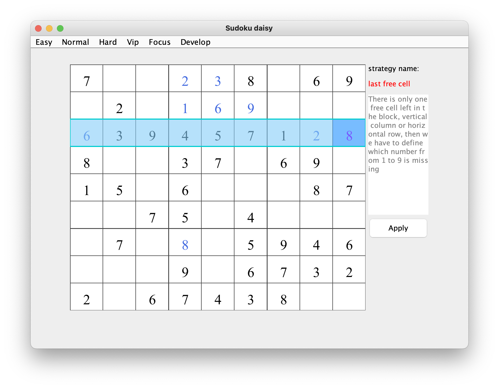

# Introduction

## How to run

## Strategy
* last free cell    
brief：There is only one free cell left in the block, vertical column or horizontal row, then we have to define which number from 1 to 9 is missing
the example for a row:   

the example for a column :   

the example for a box :   

   
* last possible number    
brief： Check what numbers do the block, vertical column and horizontal row have for the cell, then find out the missing one.

* hidden singles    
brief：    

* obvious pairs    
brief：    

* obvious triples    
brief：    

* hidden pairs    
brief：    

* hidden triples    
brief：    

* pointing pairs    
brief：    

* x wing    
brief：    

* xy wing    
brief：    

* swordfish    
brief：    

* hidden three    
brief：    

## Solver

## Game Designer

