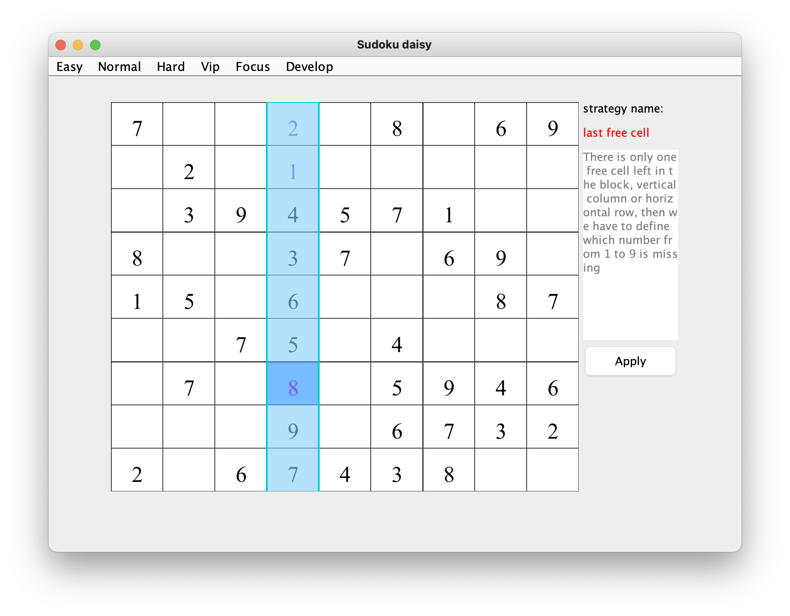
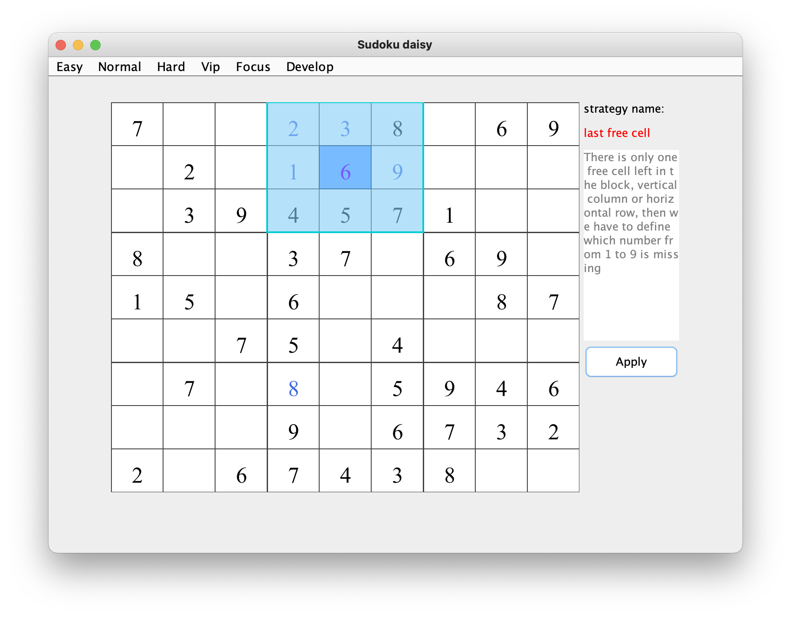
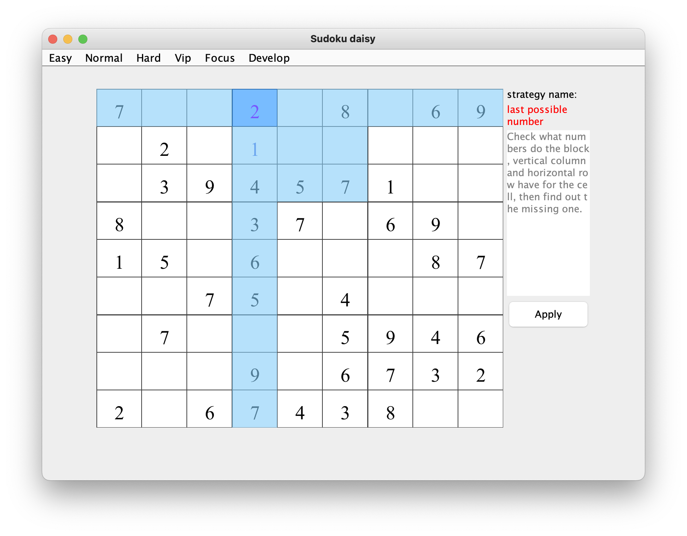
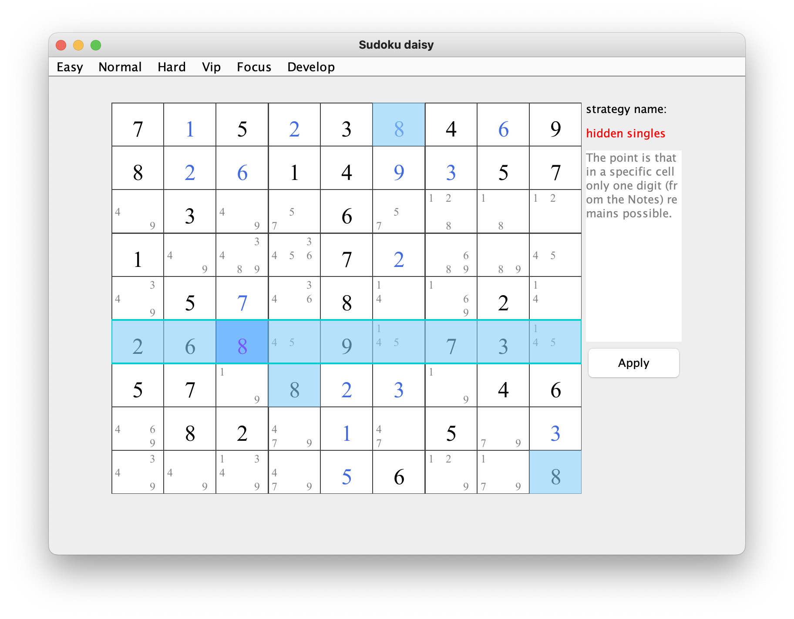
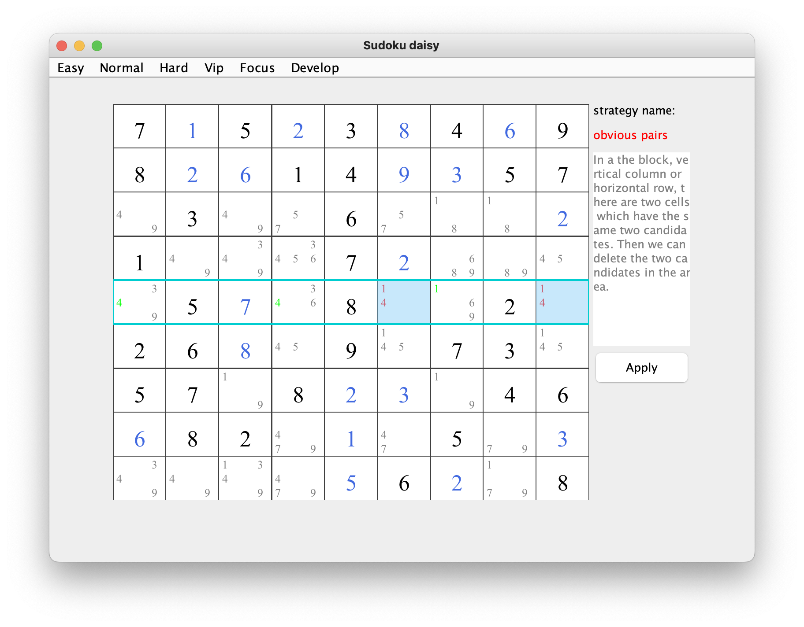
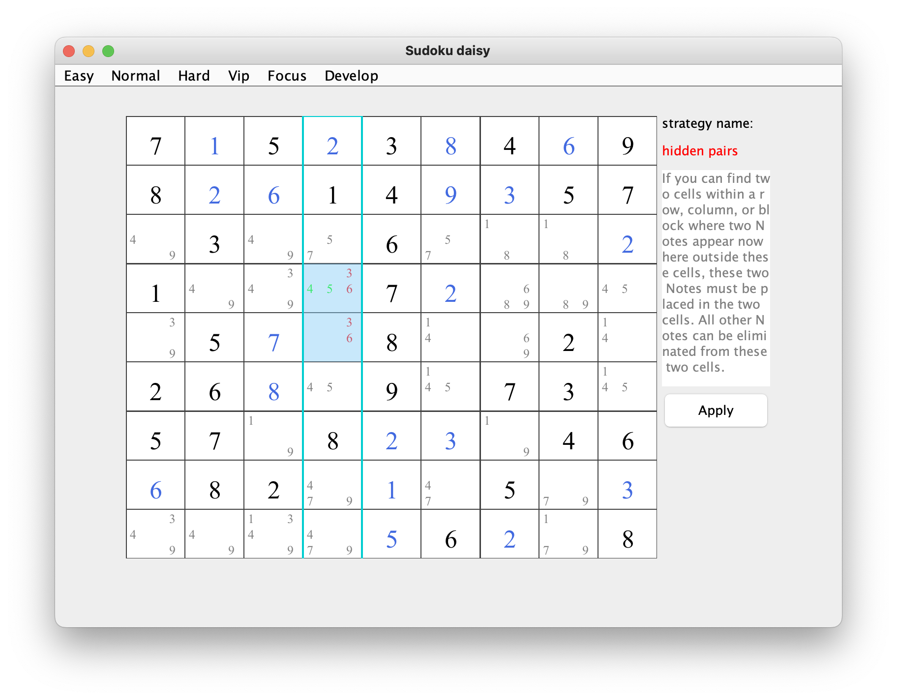

# Introduction

## How to run

## Strategy
* last free cell    
brief：There is only one free cell left in the block, vertical column or horizontal row, then we have to define which number from 1 to 9 is missing     
the example for a row:   

the example for a column :   

the example for a box :   

   
* last possible number    
brief： Check what numbers do the block, vertical column and horizontal row have for the cell, then find out the missing one.

* hidden singles    
brief：The point is that in a specific cell only one digit (from the Notes) remains possible.     

* obvious pairs    
brief：In a block, vertical column or horizontal row, there are two cells which have the same two candidates. Then we can delete the two candidates in the area.     

* obvious triples    
brief： In a block, vertical column or horizontal row, there are three cells which have the three pairs candidates. Then we can delete the three candidates in the area.     

* hidden pairs    
brief：If you can find two cells within a row, column, or block where two Notes appear nowhere outside these cells, these two Notes must be placed in the two cells. All other Notes can be eliminated from these two cells.     

* hidden triples    
brief：When three cells in a row, column, or block contain the same three Notes. These three cells also contain other candidates, which may be removed from them     

* pointing pairs    
brief：When a Note is present twice or three in a block and this Note also belongs to the same row or column. This means that the Note must be the solution for one of the two cells in the block. So, you can eliminate this Note from any other cells in the row or column.     

* x wing    
brief：Find the four cells which is a X patten. The four cells have a candidate which doesn't belong to the other cell in the row or column. Then we can delete the  candidate in the column or row.     

* xy wing    
brief： "Y-Wing" technique is similar to "X-Wing", but it based on three corners instead of four.     

* swordfish    
brief："Swordfish" is similar to X-wing but uses three sets of cells instead of two.     

* hidden three    
brief：In a block, vertical column or horizontal row， there are three cells which have the same three candidates. Then we can delete the three candidates in the area.     

## Solver

## Game Designer

