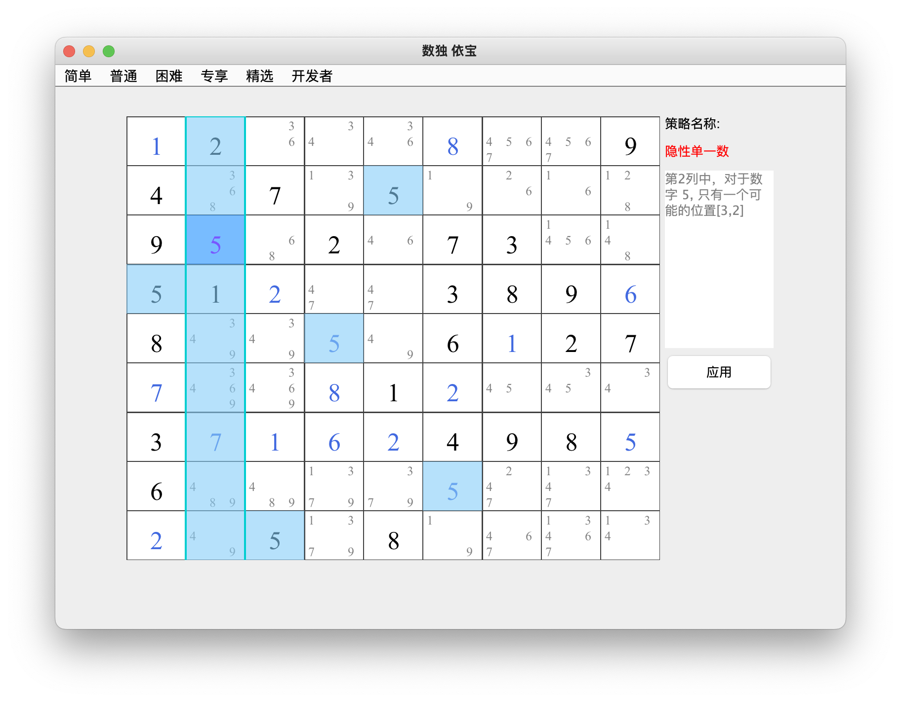
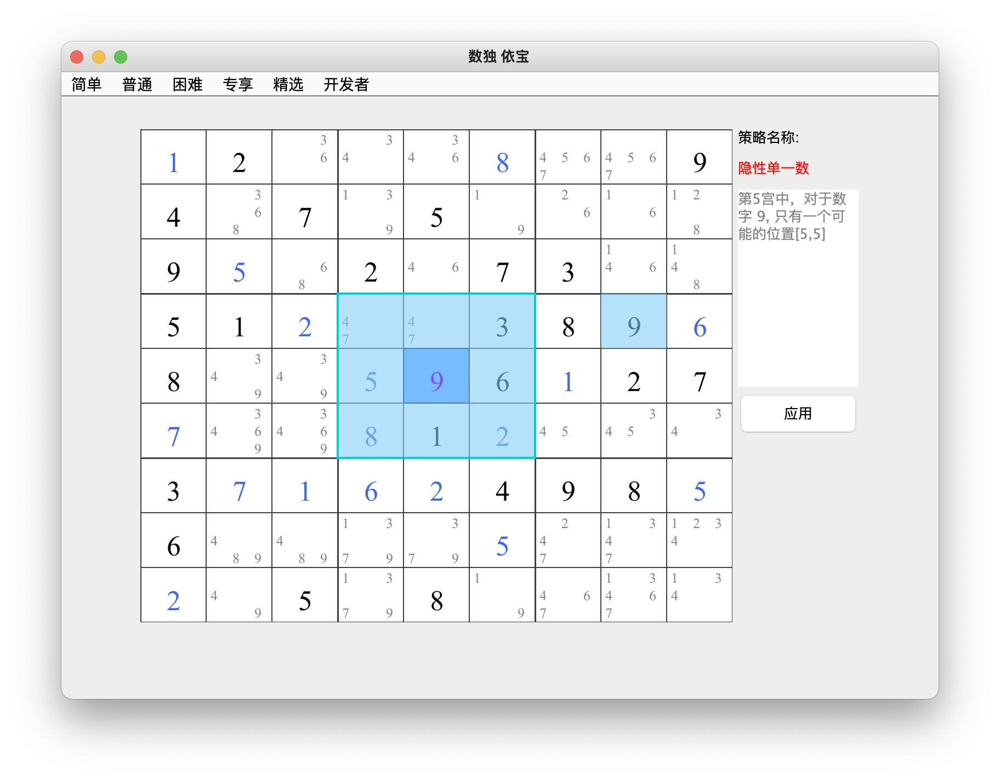

## 隐性单一数    
### 介绍：在一个宫、一行或一列中对于特定的某个数字只有一个可行的位置 
3种类型：行隐性单一数 、列隐性单一数 、宫隐性单一数         
* 类型1： 行隐性单一数      
第5行中，对于数宇 1，只有一个可能的位置[5,7]   

* 类型2：列隐性单一数         
第2列中，对于数字5，只有一个可能的位置[3,2]

* 类型3：宫隐性单一数         
第5宫中，对于数字9，只有一个可能的位置[5,5]
