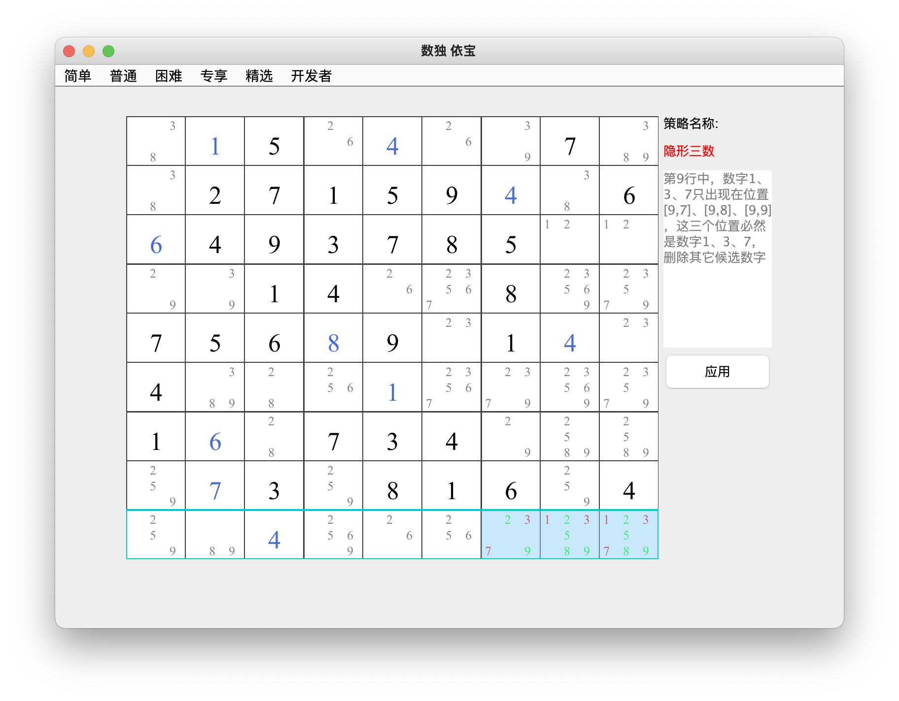
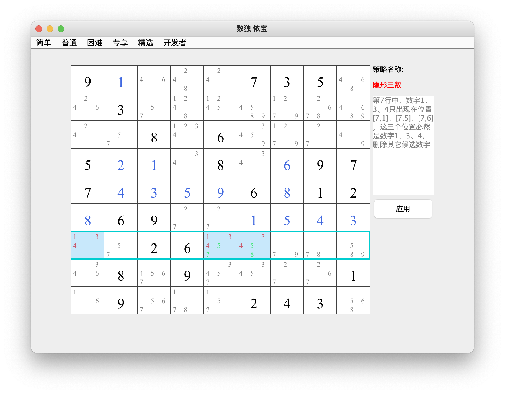

## 隐形三数    
### 介绍：在一个宫、一行或一列中的三个单元格包含三条未出现在其他地方的笔记，这三个单元格还包含其他候选数，可以将它们删除。     
12种类型：维度一3种：行、列、宫；维度二数量4种：222、223、233、333，组合后共12种，这里以行为例列举2种，其它10种类似
* 类型1：基于行的222类型     
第9行中，数字1、3、7只出现在位置[9,7]、[9,8]、[9,9]，这三个位費必然是数宇1、3、7,删除其它候选数字      
        
* 类型2：基于行的233类型     
见图中解释           
          
