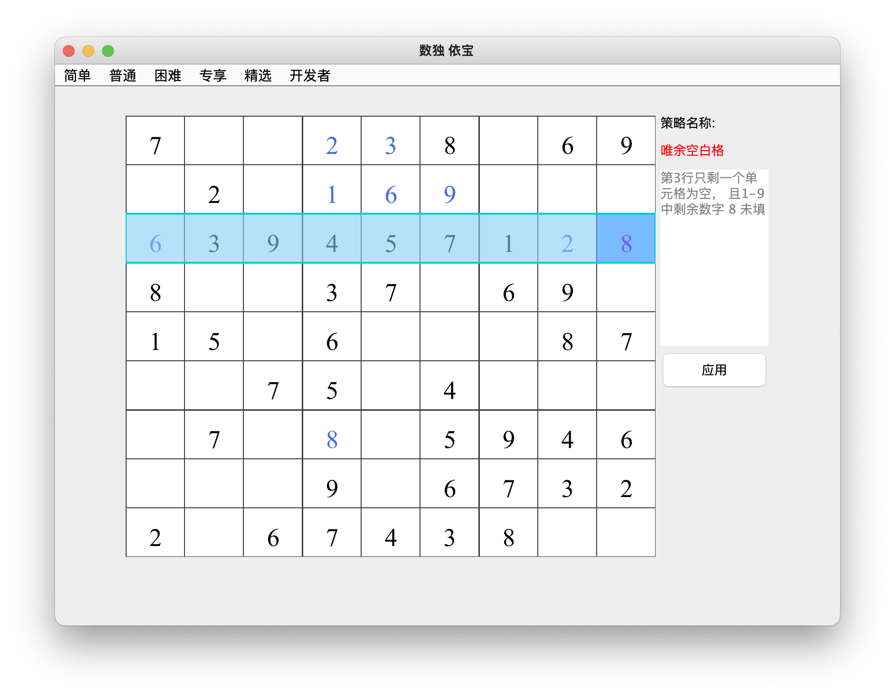

## 唯余空白格   
### 介绍：一个宫、一行或一列中只剩下一个空白单元格，找出缺少哪个数字，将它填入这个空白单元格      
分为三张类型：行唯余空白格、列唯余空白格、宫唯余空白格
* 类型1： 行唯余空白格    
第3行只剩一个单元格为空，且1-9中剩余数字8未填        

* 类型2： 列唯余空白格
第4列只剩一个单元格为空，且1-9中剩余数字8未填       

* 类型3：宫唯余空白格
第2宫只剩一个单元格为空，且1-9中剩余数字6未填       

   