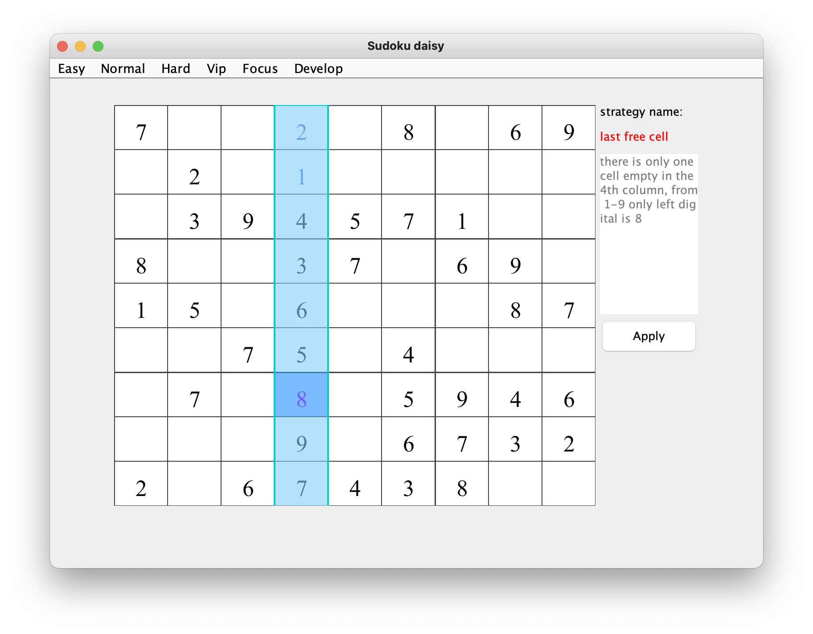

## last free cell    
### brief：There is only one free cell left in the block, vertical column or horizontal row, then we have to define which number from 1 to 9 is missing     
3 different examples
* 1/3 the example for a row:    

* 2/3 the example for a column :   

* 3/3 the example for a box :   
