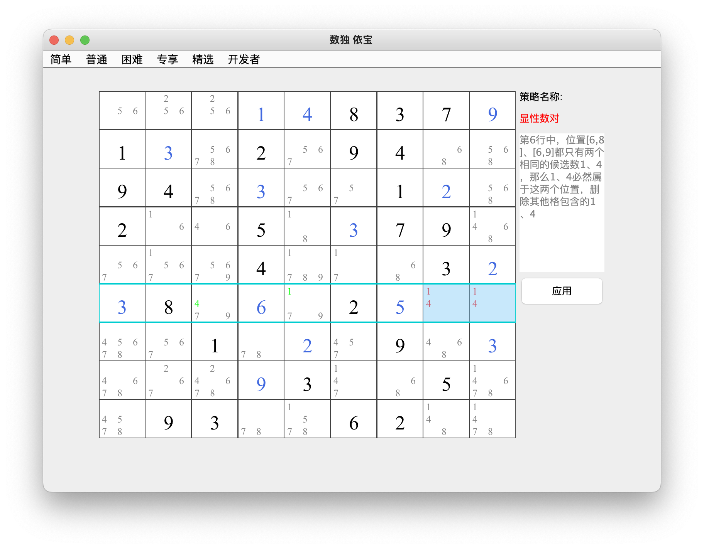
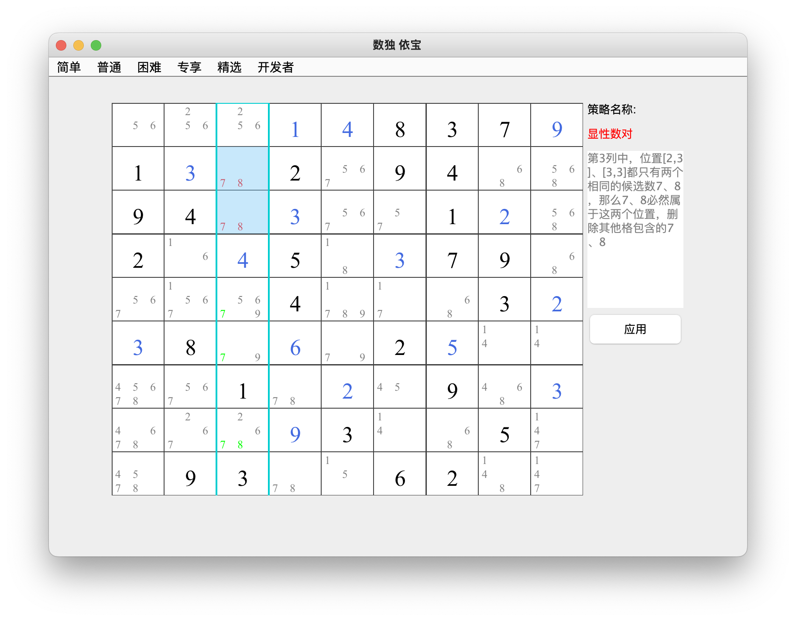

## 显性数对    
### 介绍：一个宫、一行或一列里找到两个拥有相同的两个候选数的格，则可从该单元里的其他格中排除那两个候选数     
3种类型：行显性数对 、列显性数对 、宫显性数对      
* 类型1：行显性数对      
第6行中，位置[6,8]、[6,9]都只有两个相同的候选数1、4那么1、4必然属于这两个位置，删除其他格包含的1、4 

* 类型2：列显性数对             
见图中解释           

* 类型3：宫显性数对           
见图中解释        
