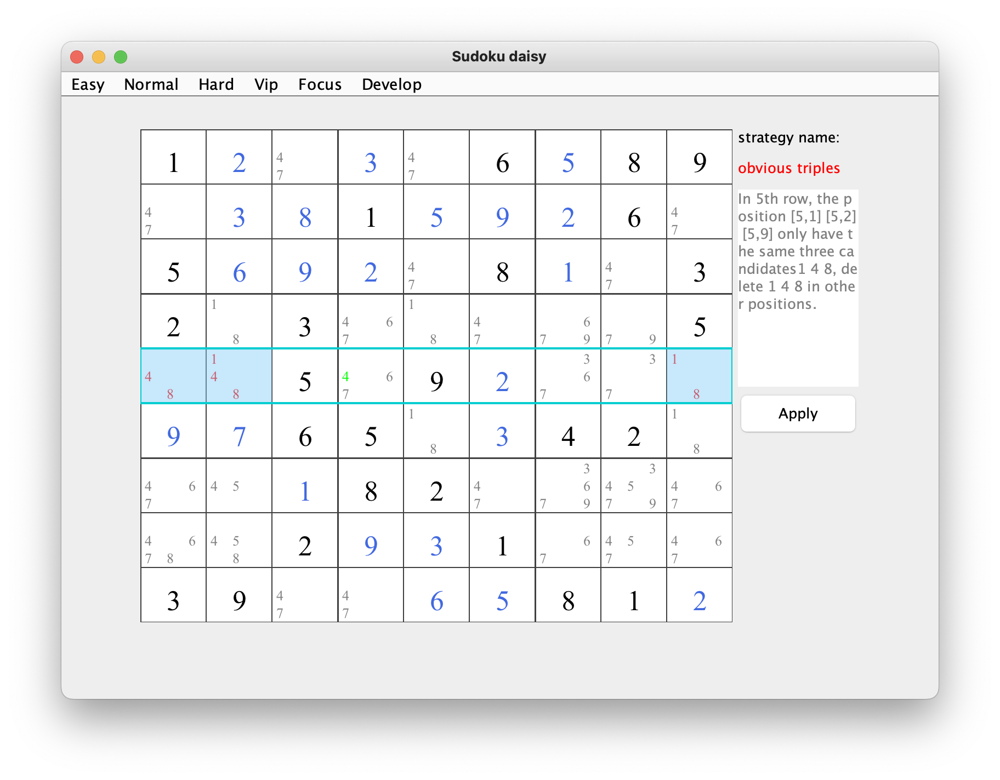
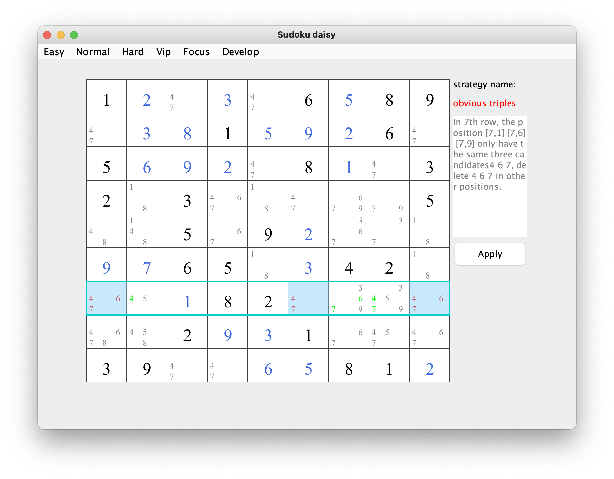
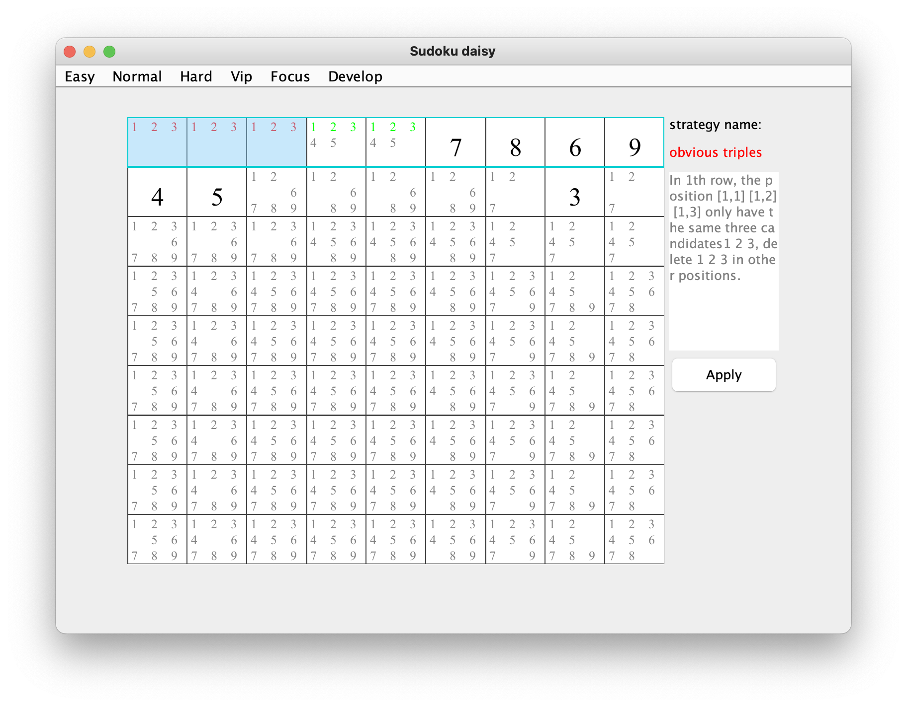

## obvious triples    
### brief： In a block, vertical column or horizontal row， there are three cells which only contain three same candidates. Then we can delete the three candidates in the area.     

