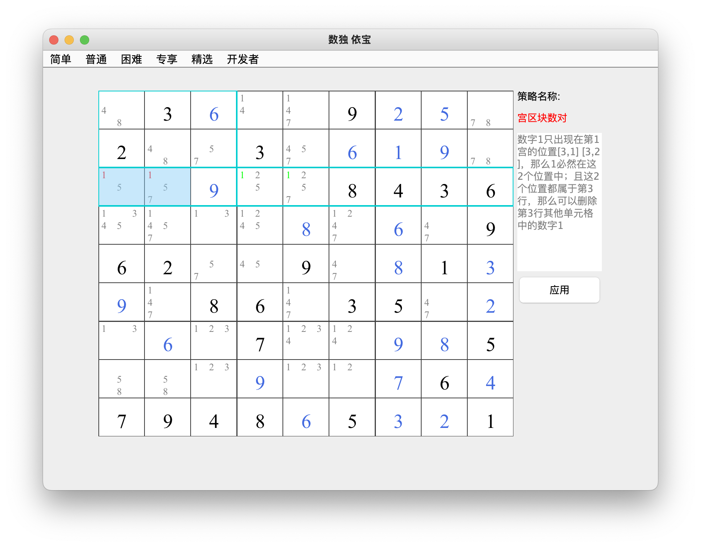
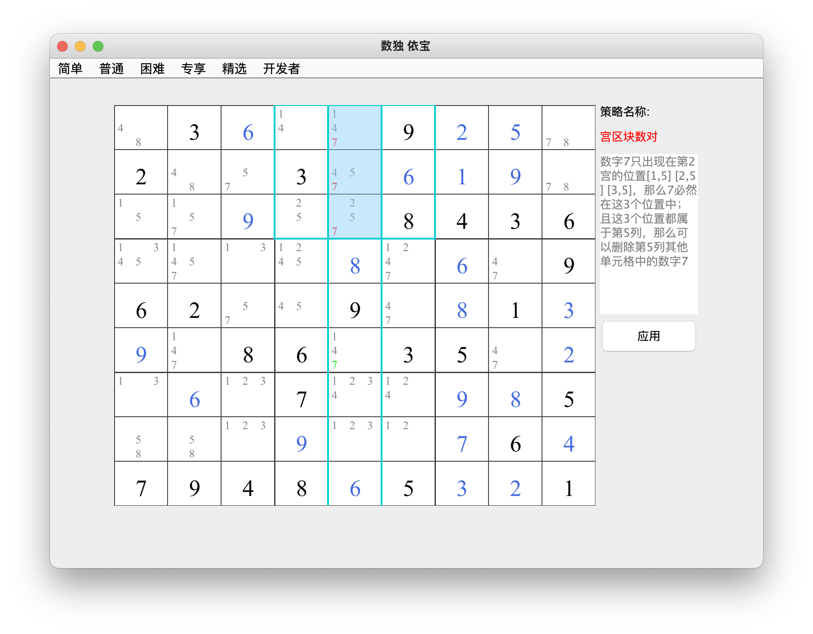

## 宫区块数对    
### 介绍：当一条笔记在一个宫中出现两次或者三次并且该笔记属于同一行或列时，这说明该笔记必然是这个宫中解，可以将该笔记从这一行或列的任何其他单元格中删除。     
2种类型：行宫区块数对、列宫区块数对        
* 类型 1:行宫区块数对           
数字1只出现在第1宫的位置[3,1] [3,2]，那么1必然在这2个位置中；且这2个位置都属于第3行，那么可以删除第3行其他单元格中的数字1
        
* 类型 2:列宫区块数对        
见图中解释          
      