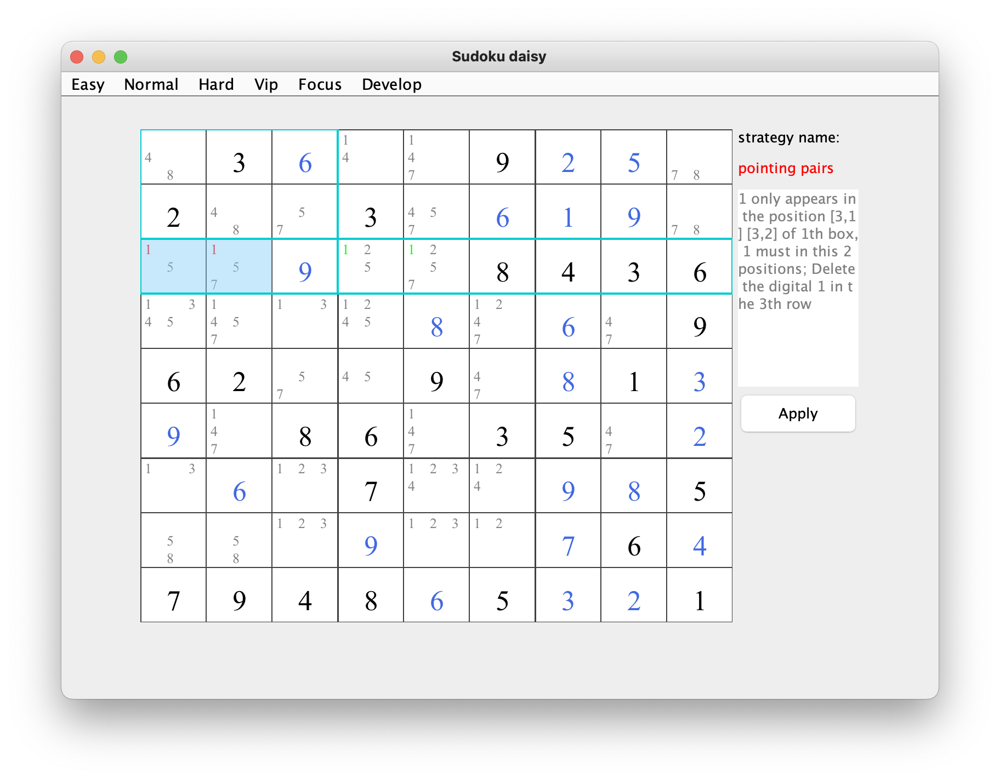
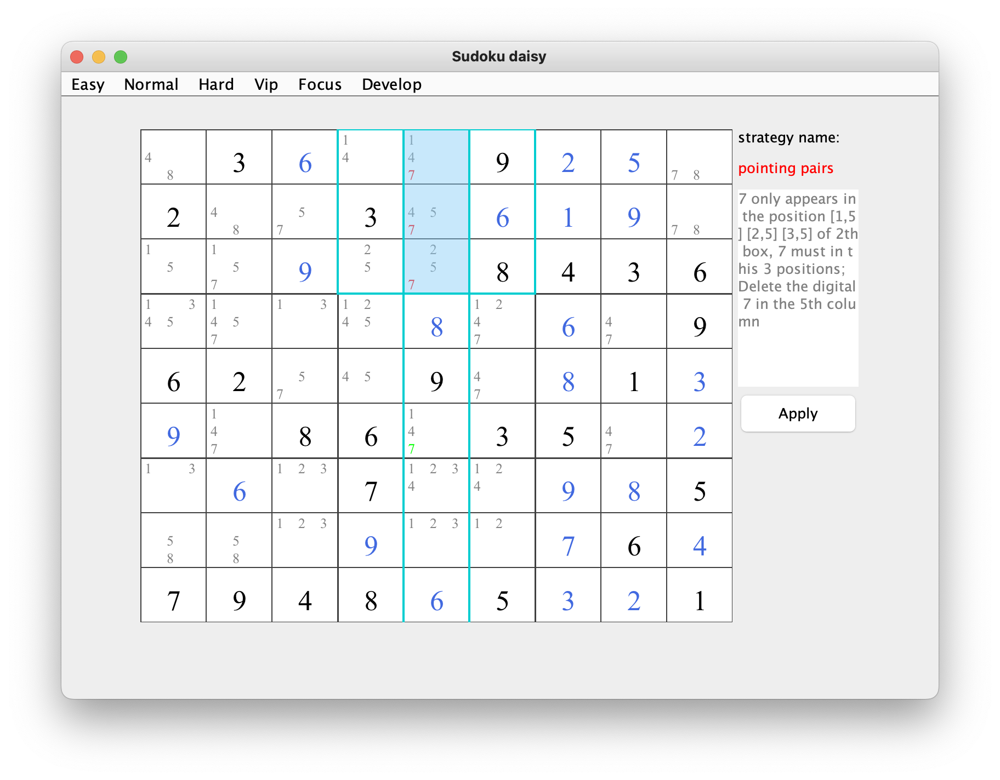

## pointing pairs    
### brief：When a Note is present twice or three in a block and this Note also belongs to the same row or column. This means that the Note must be the solution for one of the two cells in the block. So, you can eliminate this Note from any other cells in the row or column.     
s

   