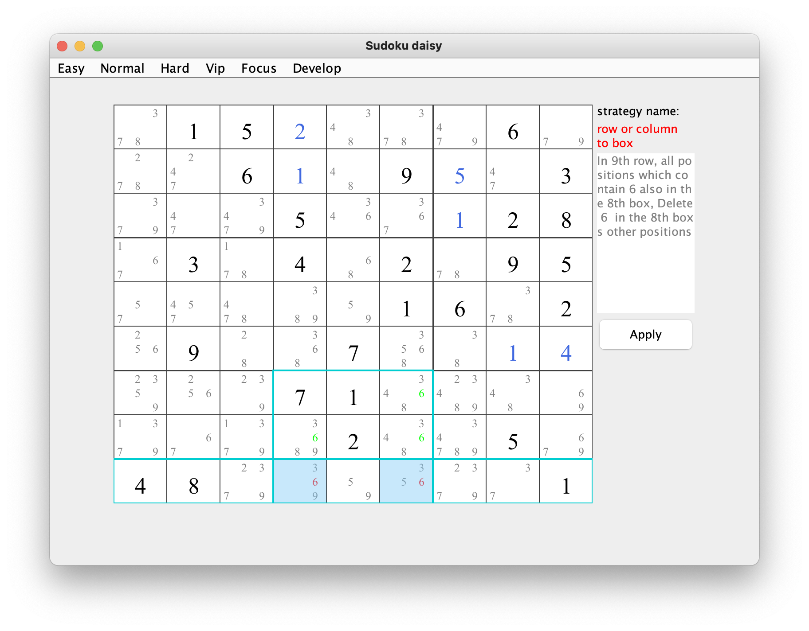
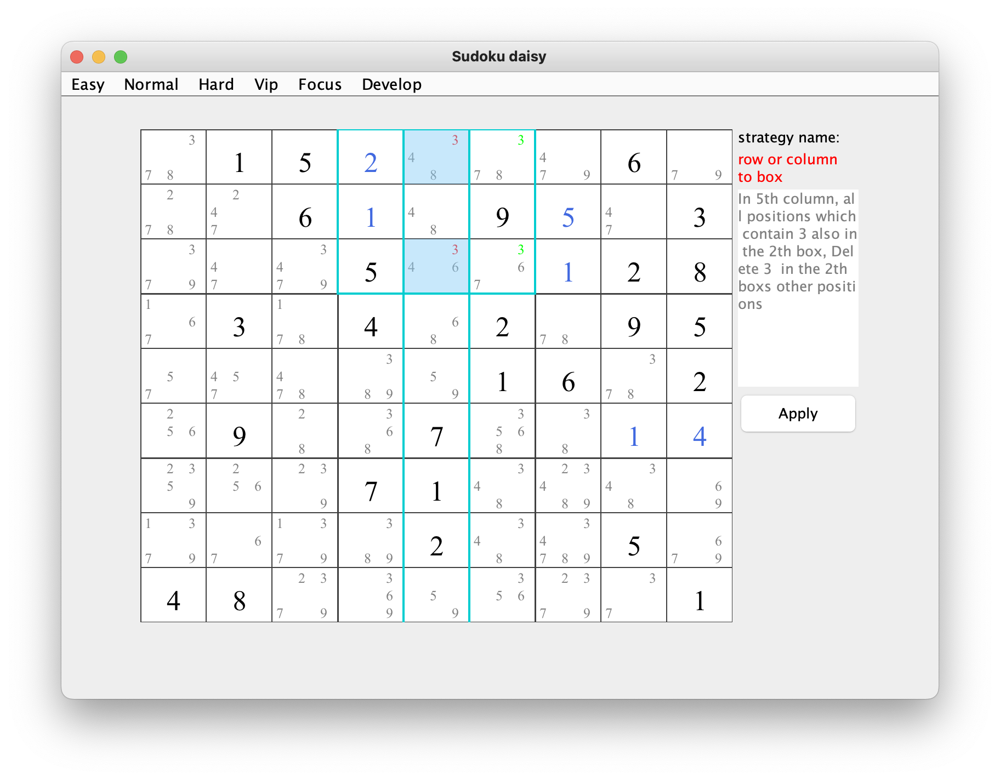

## row column to box
### brief：A candidate in a row or column, and all the cell also in a box. Then we can delete the candidate in other cells in the box.         
2 different examples      
* 1/2 the example for a row:         
       
* 1/2 the example for a column:    
     