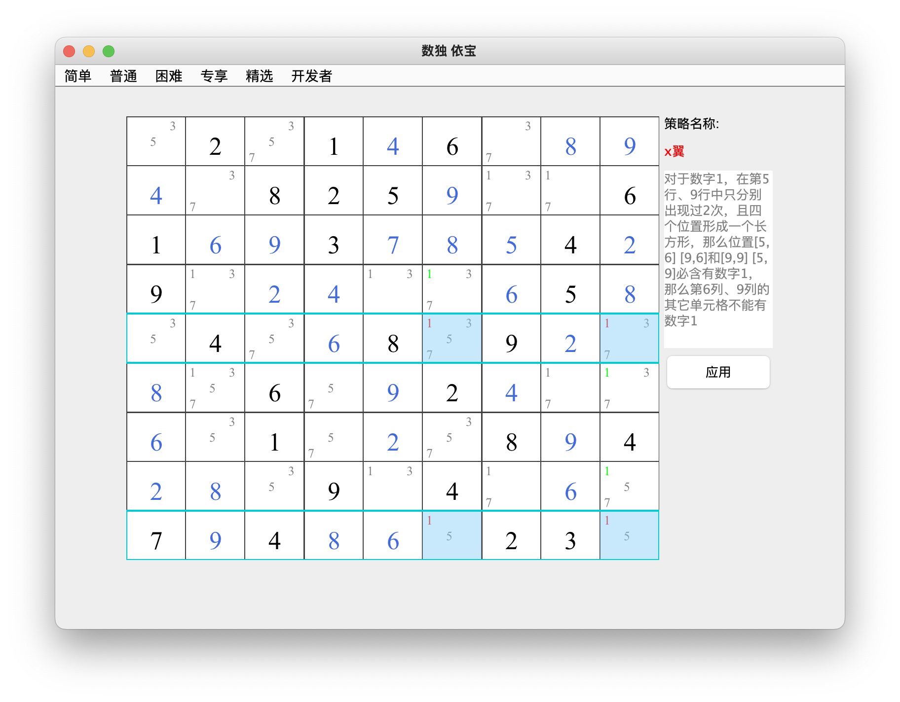
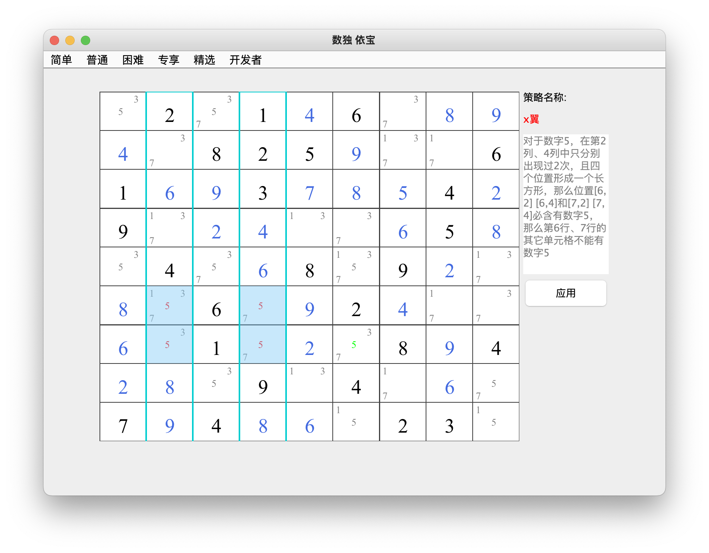

## x翼    
### 介绍：寻找四个对齐的单元格形成一个X，并且有相同的候选数没有出现在同一行或同一列的其他地方，那么可以删除对应列或行的后续数     
两种类型：行x翼 、列x翼 
* 类型1: 行x翼       
对于数字1，在第5行、9行中只分别出现过2次，且四个位置形成一个长方形、那么位置[5,6] [9,6]和[9,9]、[5，9]必含有数字1,那么第6列、9列的其它单元格不能有数字1

* 类型2: 列x翼       
见图中解释              
