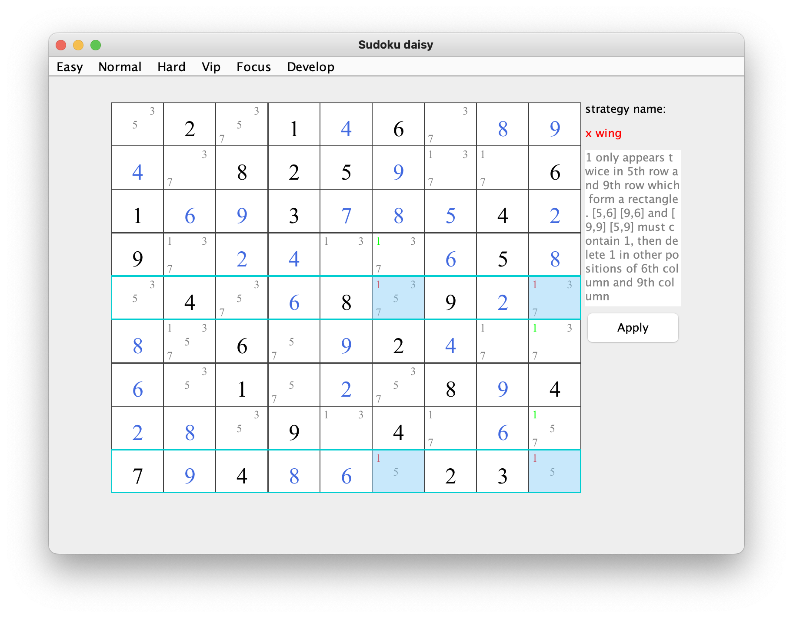
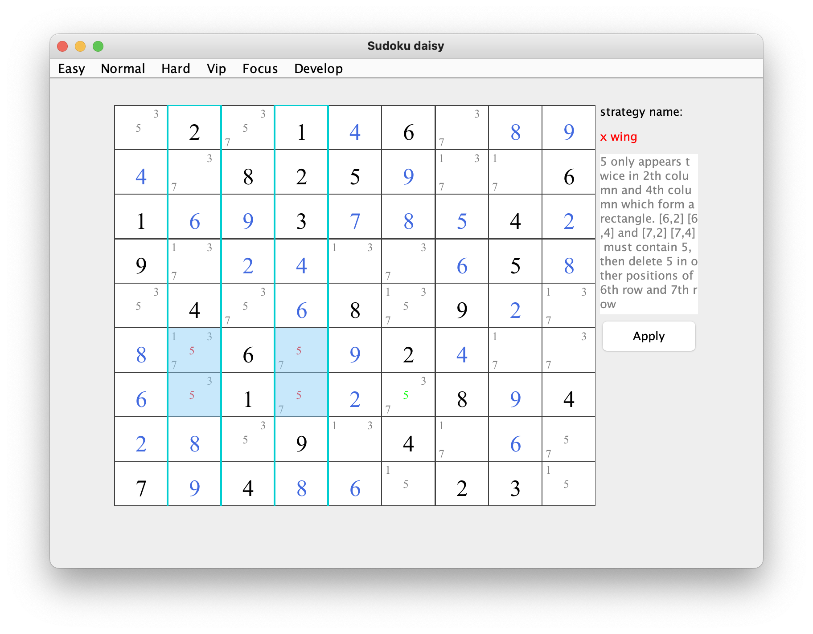

## x wing    
### brief：Find the four cells which is a X patten. The four cells have a candidate which doesn't belong to the other cell in the row or column. Then we can delete the  candidate in the column or row.     

