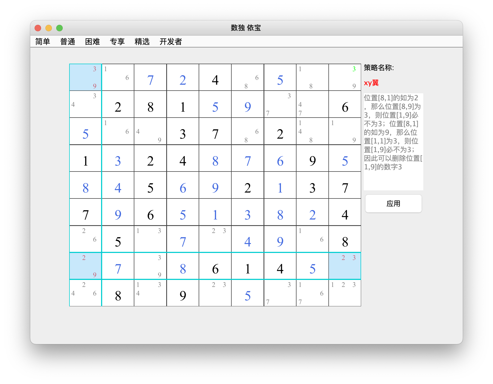
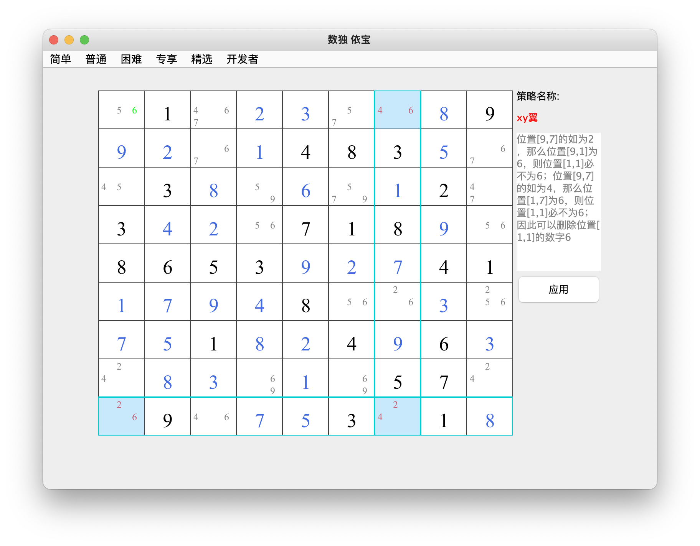
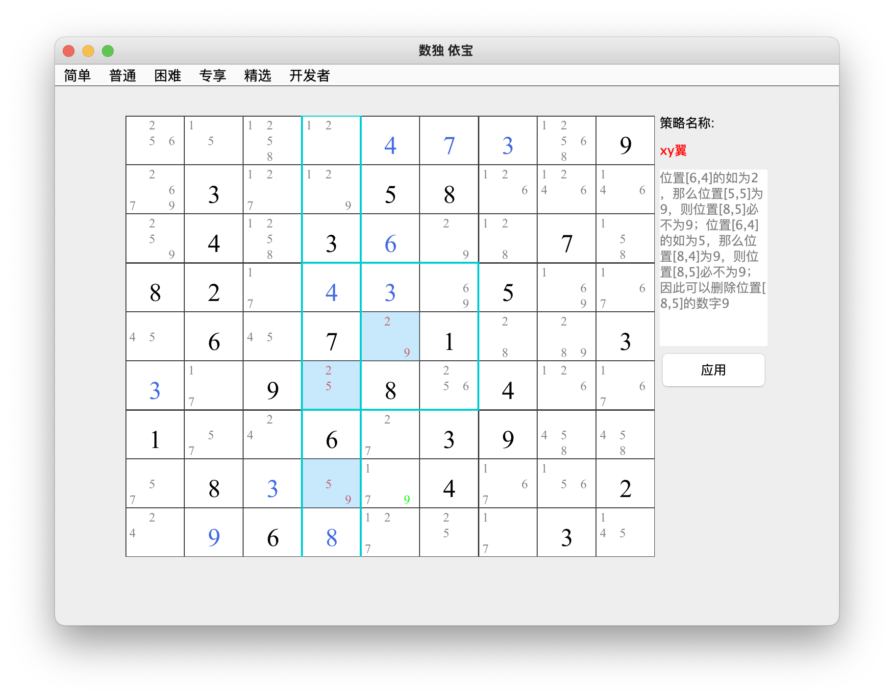
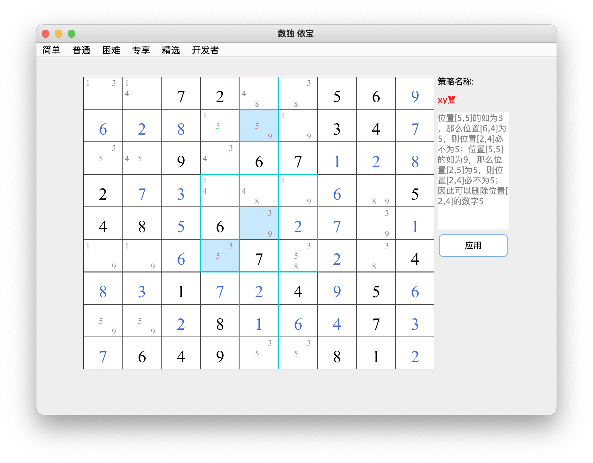
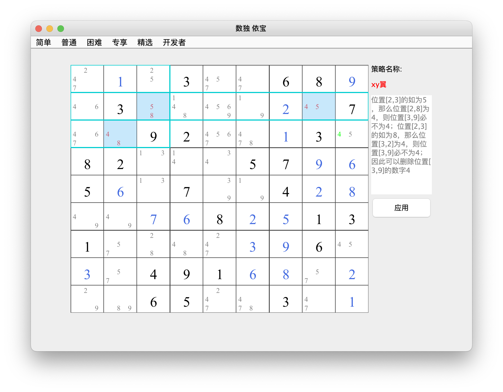
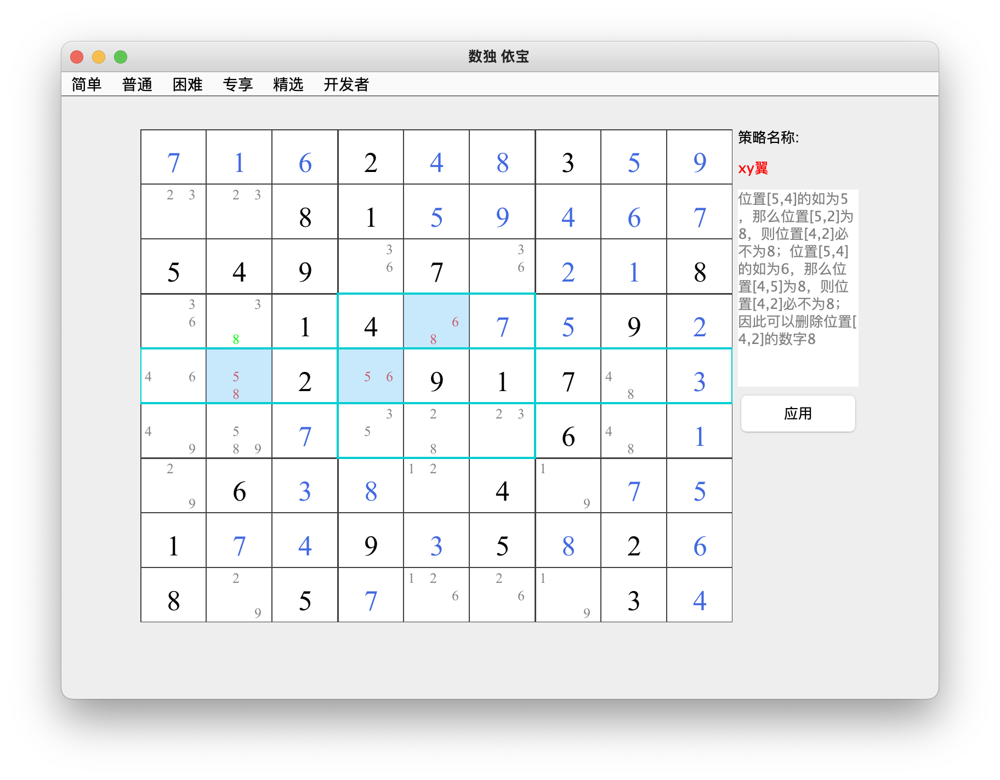

## xy翼    
### 介绍：由三个双值单元格构成，两个单元格作为“钳”，一个作为“折”，“钳”和“折”位于同一行、同一列或同一宫中。每个“钳”中的两个数字之一应该与“折点”中的相同。两个“钳”中的另一个数字相同"。可以删除另一个“折”的的后续数。    
6种类型： 行左列xy翼、行有列xy翼、宫左列xy翼、宫右列xy翼、宫左行xy翼、宫右行xy翼
* 类型1：行左列xy翼     
位置[8,1]的如为2，那么位置[8,9]为3，则位置[1,9]必不为3；位置[8,1]的如为9，那么位置[1,1]为3，则位置[1,9]必不为3；因此可以删除位置[1,9]的数字3

* 类型2：行有列xy翼      
见图中解释              

* 类型3：宫左列xy翼       
见图中解释              

* 类型4：宫右列xy翼     
见图中解释              

* 类型5：宫左行xy翼     
见图中解释              

* 类型6：宫右行xy翼     
见图中解释              
